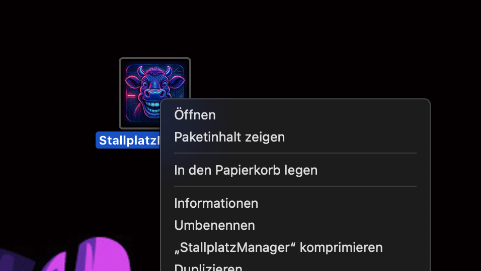
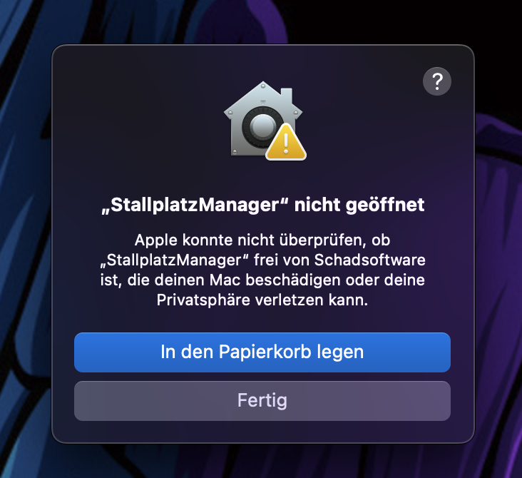
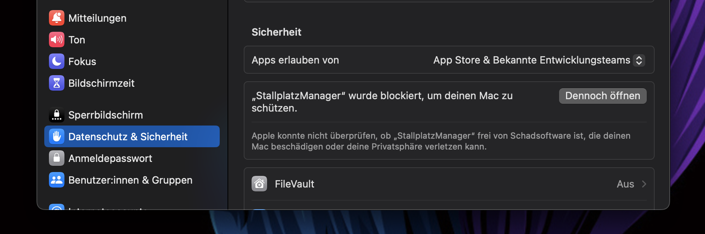
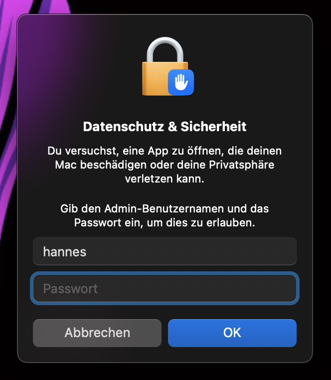

# Stallplatz-Management - Digitale Stalltafel

Ein einfaches Programm zur Verwaltung von Stallplätzen für Rinder, aufgeteilt in Einzelplätze und Gruppenboxen.

---

## Installation

1.  Gehen Sie zur [**Releases-Seite**](https://github.com/DEIN_BENUTZERNAME/DEIN_REPO_NAME/releases) dieses Projekts. (Bitte ersetzen Sie den Link durch Ihren eigenen).
2.  Laden Sie die `.zip`-Datei für Ihr Betriebssystem herunter (`windows`, `macos` oder `linux`).
3.  Entpacken Sie die Datei. Sie können das Programm nun direkt aus dem entpackten Ordner starten.

---

## Wichtiger Hinweis für macOS-Benutzer

Da die Anwendung nicht von Apple notariell beglaubigt ist (ein kostspieliger Prozess für verifizierte Entwickler), wird macOS den ersten Start aus Sicherheitsgründen blockieren. Sie müssen die App manuell genehmigen.

**Folgen Sie diesen Schritten, um die App zu öffnen:**

**1. Rechtsklick auf die App und "Öffnen"**

Führen Sie keinen Doppelklick aus. Machen Sie stattdessen einen Rechtsklick auf das Programmsymbol und wählen Sie im Kontextmenü die Option "Öffnen".

**2. Erneutes "Öffnen" bestätigen**

Es erscheint ein Dialogfenster, das Sie warnt. Hier haben Sie nun die Möglichkeit, auf "Öffnen" zu klicken. (Diese Option erscheint nicht bei einem normalen Doppelklick).

*Sollte diese Option nicht erscheinen, klicken Sie auf "Fertig" und fahren Sie mit Schritt 3 fort.*

**3. Systemeinstellungen öffnen (falls Schritt 2 nicht klappt)**

Gehen Sie zu **Systemeinstellungen > Datenschutz & Sicherheit**. Scrollen Sie nach unten zum Abschnitt "Sicherheit".

Dort sehen Sie eine Meldung über die blockierte App. Klicken Sie auf die Schaltfläche **"Dennoch öffnen"**.

**4. Passwort eingeben**

Sie werden aufgefordert,Benutzernamen natürich Ihren NICHT "hannes" , Ihr Mac-Benutzerpasswort einzugeben, um die Ausnahme zu bestätigen.

**5. Fertig!**

Das Programm startet nun. Sie müssen diese Schritte **nur beim allerersten Start** durchführen. Danach können Sie die App wie gewohnt per Doppelklick öffnen.